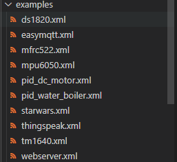

## 示例程序文件目录存放在examples：



### 示例程序界面显示配置config/examples_source.js：


```
配置示例，
如果需要配置文件夹
{
    text: '对应文件夹名称'
},
如果配置文件
{
	text: '案例名称',
    icon: "jstree-file", // 图标
}

配置二级，需要在对应文件夹下添加children: [], ([]数组里面配置文件/文件夹)
{
    text: '对应文件夹名称',
    children: [
    	{}
    ]
},
```

